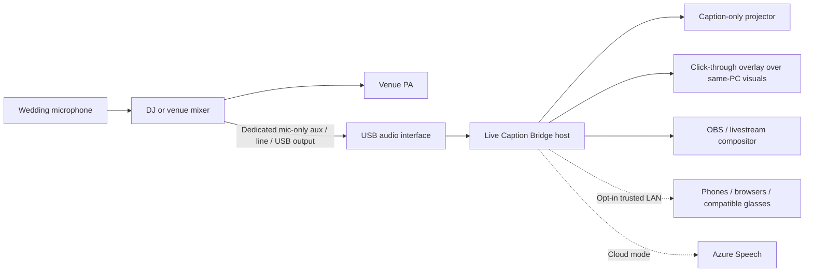

# Live Caption Bridge

Local-first live caption delivery for projectors, OBS, nearby browsers, mobile devices, and future wearable clients. The first qualified reference solution is a Windows-operated English–Vietnamese wedding preset.

> **Read first:** [`PROJECT_CONTEXT.md`](PROJECT_CONTEXT.md) is the canonical record of product decisions, verified behavior, field-validation gaps, vendor roles, and backlog. This is an engineering alpha, not yet wedding-qualified. Keep a rehearsed production fallback.

## What the alpha implements

- Electron, React, and strict TypeScript Windows host
- Exact audio-device selection, input meter, clipping warning, and device-loss pause
- 16 kHz mono PCM AudioWorklet capture without raw-audio persistence
- Azure Speech Translation with `Auto`, `English`, and `Vietnamese` recognition modes
- Locale-neutral, versioned caption events with English/Vietnamese wedding presentation profiles
- Interim replacement, finalized history, fixed bilingual lanes, reconnect state, and explicit UTF-8 exports
- Caption-only fullscreen window
- Frameless, always-on-top, click-through presentation overlay
- Transparent OBS browser source
- Opt-in authenticated LAN receiver for up to 50 read-only devices
- Session-only Azure credentials or Windows `safeStorage`; no application telemetry
- Development-only Docker fixtures and gated offline benchmarks

Not yet field-verified: live Azure quality, a real mixer/USB interface, PowerPoint/VLC overlay recovery, external projector behavior, venue LAN latency, OBS headroom, two-hour stability, and the bilingual acceptance suite.

## Wedding signal path



Never put the caption host in the PA path. A host crash must not interrupt wedding audio. Prefer a post-fader, mic-only aux feed and exclude music and room microphones.

## Presentation choices

| Need | Use |
|---|---|
| Captions are the entire projector image | Caption-only fullscreen |
| PowerPoint, browser video, or VLC runs on the caption PC | Native click-through overlay with windowed/borderless visuals |
| Livestream, camera feed, external visual source, or maximum compositing reliability | OBS transparent browser source |
| Personal captions on nearby devices | Opt-in LAN receiver; authenticated but not encrypted |

Exclusive-fullscreen applications can cover desktop overlays. Switch the visual to a windowed/borderless mode or use OBS.

Loopback endpoints:

- Screen: `http://127.0.0.1:43117/overlay?mode=screen`
- OBS: `http://127.0.0.1:43117/overlay?mode=obs`
- Versioned WebSocket: `ws://127.0.0.1:43117/events`
- Caption-free health: `http://127.0.0.1:43117/health`

LAN sharing is a separate service on a selected private interface at port `43118`. It is off by default, creates a new 128-bit pairing token, places that token in the QR URL fragment, requires it in the first WebSocket message, and invalidates it when sharing or the session ends.

## Development

Requirements: Windows 11, Node.js 22+, pnpm 11, and an Azure Speech resource for real-provider testing.

```powershell
pnpm install
pnpm dev
pnpm check
pnpm test:e2e
pnpm dist:win
```

The pnpm workspace contains:

- `apps/desktop-host` — Electron operator, audio, providers, presentation, and local servers
- `apps/web-receiver` — responsive authenticated receiver page
- `packages/caption-protocol` — public versioned events and shared contracts
- `packages/caption-client` — validation, pairing, and receiver helpers

Real Azure tests and model benchmarks remain opt-in because they require credentials, hardware, or large downloads.

## Privacy and vendor fallbacks

The app sends live PCM to Azure in cloud mode but never records raw audio. Caption text remains in memory until the operator explicitly exports it. Operational health endpoints and logs exclude captions, audio, credentials, and pairing tokens.

Wordly remains the venue-oriented turnkey fallback. Notta is documented only as a connected, explicit-consent backup and rehearsal comparator because it records and retains audio/transcripts in its cloud account. See [build vs. buy](docs/BUILD_VS_BUY.md) and the [Notta evaluation](docs/NOTTA_EVALUATION.md).

## Documentation

- [Architecture and trust boundaries](docs/ARCHITECTURE.md)
- [Venue AV setup](docs/AV_SETUP.md)
- [Azure setup](docs/AZURE_SETUP.md)
- [Presentation and OBS setup](docs/OBS_SETUP.md)
- [LAN receiver setup](docs/LAN_RECEIVERS.md)
- [Privacy and consent](docs/PRIVACY.md)
- [Rehearsal and release gates](docs/REHEARSAL_RUNBOOK.md)
- [Offline benchmark](docs/OFFLINE_BENCHMARK.md)
- [Build vs. buy](docs/BUILD_VS_BUY.md)
- [Release process](docs/RELEASE.md)
- [Security policy](SECURITY.md)

## Docker scope

Docker Compose is development-only for linting, tests, WAV fixtures, offline benchmarks, and model conversion. The wedding runtime is the native Windows app. Docker Desktop does not directly pass USB devices through to containers, and Windows GPU support is limited to WSL2 with NVIDIA hardware. See Docker's [USB FAQ](https://docs.docker.com/desktop/troubleshoot-and-support/faqs/general/) and [GPU support](https://docs.docker.com/desktop/features/gpu/).

## License

MIT. Model weights are not included; optional model licenses are tracked separately in [`MODEL_LICENSES.md`](MODEL_LICENSES.md).
