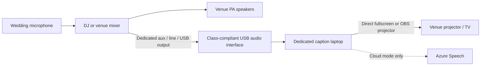

# Wedding Live Captions

Windows-first live English–Vietnamese captions for bilingual weddings. The app takes a direct mixer feed, sends 16-kHz mono PCM to Azure Speech Translation, and keeps English in the upper audience lane and Vietnamese in the lower lane.

> **Release status:** v0.1 is an engineering MVP, not yet wedding-qualified. Do not make it the primary caption solution until the acceptance suite and two venue-style rehearsals in [the runbook](docs/REHEARSAL_RUNBOOK.md) pass. Keep a hotspot and a staffed service such as Wordly available.

## What works in v0.1

- Host audio-device selection, input meter, clipping warning, and disconnect pause
- Azure Speech Translation with `Auto`, `English`, and `Vietnamese` modes
- Source partials, finalized bilingual segments, and in-place partial revision
- One-click audience fullscreen and a transparent OBS browser source
- Localhost-only display service at `127.0.0.1:43117`
- Memory-only captions and explicit TXT, JSON, or bilingual WebVTT export
- Optional Windows-encrypted credential storage through Electron `safeStorage`
- No application telemetry or raw-audio recording
- Development-only PCM fixture provider and offline benchmark harness

Offline inference is deliberately **not shipped**. It remains gated on the benchmark and live-event criteria in [Offline benchmark](docs/OFFLINE_BENCHMARK.md).

## Signal path



The caption laptop is never inline with the PA. A caption failure must not interrupt guest audio. See [Venue AV setup](docs/AV_SETUP.md).

## Quick start for development

Prerequisites: Windows 11, Node.js 22 or newer, pnpm, and an Azure Speech resource.

```powershell
pnpm install
pnpm dev
```

Then select the soundboard interface, enter the Azure region and key, choose the external display, and press **Start captions**. Credential setup is described in [Azure setup](docs/AZURE_SETUP.md).

Run the quality suite:

```powershell
pnpm check
pnpm test:e2e
pnpm dist:win
```

The audience endpoints exist only while the desktop app is running:

- Screen: `http://127.0.0.1:43117/overlay?mode=screen`
- OBS: `http://127.0.0.1:43117/overlay?mode=obs`
- WebSocket: `ws://127.0.0.1:43117/events`
- Health: `http://127.0.0.1:43117/health`

## Wedding-day operating model

1. Ask the DJ for a mic-only, post-fader auxiliary or line output.
2. Connect that output to a true line input on a class-compliant USB interface.
3. Put the dedicated caption laptop on AC power at the AV table.
4. Use direct fullscreen for captions alone. Use OBS only when compositing captions with slides, cameras, or a livestream.
5. Prefer Ethernet, rehearse a hotspot, and keep a non-app fallback.

Start with the [venue checklist](docs/AV_SETUP.md), [OBS guide](docs/OBS_SETUP.md), and [rehearsal runbook](docs/REHEARSAL_RUNBOOK.md).

## Architecture

The Electron main process owns credentials, Azure, exports, recovery, and the loopback display server. The sandboxed React renderer owns device capture and converts the selected input to 16-kHz mono PCM in an AudioWorklet. The renderer sends only validated PCM buffers over IPC; normalized caption snapshots flow back to the operator view and browser overlays.

See [Architecture](docs/ARCHITECTURE.md) and [Privacy](docs/PRIVACY.md).

## Docker scope

Docker Compose is development-only:

```bash
docker compose run --rm quality
docker compose run --rm fixture-tests
docker compose --profile offline run --rm offline-benchmark
```

The wedding runtime is the native Windows app. Docker Desktop does not directly pass USB devices through to containers, and Windows container GPU access is limited to the WSL2 backend with NVIDIA hardware. See the [Docker Desktop USB FAQ](https://docs.docker.com/desktop/troubleshoot-and-support/faqs/general/) and [GPU support](https://docs.docker.com/desktop/features/gpu/).

## Project documentation

- [Azure setup](docs/AZURE_SETUP.md)
- [Venue AV setup and troubleshooting](docs/AV_SETUP.md)
- [OBS setup](docs/OBS_SETUP.md)
- [Architecture](docs/ARCHITECTURE.md)
- [Testing and rehearsals](docs/REHEARSAL_RUNBOOK.md)
- [Offline benchmark](docs/OFFLINE_BENCHMARK.md)
- [Privacy and consent](docs/PRIVACY.md)
- [Build vs. buy](docs/BUILD_VS_BUY.md)
- [Release process](docs/RELEASE.md)
- [Model licenses](MODEL_LICENSES.md)
- [Contributing](CONTRIBUTING.md) and [security policy](SECURITY.md)

## License

Application source is released under the [MIT License](LICENSE). Azure, Electron, models, and optional tools retain their own terms. Model weights are never committed to this repository.
