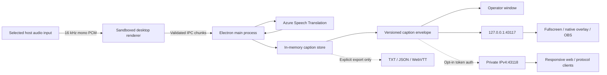

# Architecture

## Workspace and data flow

The pnpm workspace separates the Electron host, responsive web receiver, public caption protocol, and reusable client helpers. The Electron renderer has no Node access; context isolation and sandboxing remain enabled. Credentials, Azure, exports, envelope generation, display servers, and native windows live in the main process.

## Audio and providers

`getUserMedia` targets the exact operator-selected device with echo cancellation, noise suppression, and automatic gain disabled. An AudioWorklet performs linear resampling to 16 kHz and emits 100 ms mono signed-16-bit PCM chunks. Audio is never buffered to disk.

Device changes verify that the selected device still exists. Loss pauses the session and requires explicit reselection.

Providers emit locale-neutral `CaptionSegmentV1` values through `SpeechProvider`. Azure is the only shipping provider. The fixture provider is available only in unpackaged Electron tests with `LCB_E2E=1`. A Notta adapter is deliberately excluded; see the [vendor evaluation](NOTTA_EVALUATION.md).

Azure uses the universal v2 endpoint with `en-US` and `vi-VN` candidates and requests both translations. Each segment contains its source locale/text plus `texts: Record<string, string>`. The wedding preset maps `en-US` above `vi-VN`; those lanes are not baked into the transport.

If multilingual interim translation is unavailable, the source-language partial appears immediately and the translated lane fills on finalization. Language changes inside one sentence remain best-effort.

## Protocol

Every WebSocket message is a `CaptionEnvelopeV1` containing:

- protocol version
- session UUID
- monotonic message sequence
- send timestamp
- event type (`snapshot` or `status`)
- typed payload

The caption store retains finalized segments in memory for optional export. Presentation snapshots contain only the current partial and two latest finalized segments. A final replaces a matching final ID and clears the active partial.

`packages/caption-client` validates envelopes, builds authentication messages, extracts fragment tokens, normalizes receiver preferences, and selects locale text. Version changes require compatibility tests.

## Presentation

- **Fullscreen:** opaque, caption-only BrowserWindow on the selected display.
- **Native overlay:** transparent, frameless, always-on-top, non-focusable, non-resizable BrowserWindow. Electron ignores its mouse events, so it does not intercept PowerPoint/video interaction.
- **OBS:** transparent loopback browser page designed for a 1920×1080, 30 FPS browser source.

The native overlay is positioned and sized from validated operator settings. Exclusive-fullscreen applications may bypass desktop composition; use windowed/borderless playback or OBS.

## Network trust boundaries

The default server binds explicitly to `127.0.0.1:43117`. `/health` contains provider state and timestamps only. `/events` carries versioned envelopes to trusted same-host displays.

LAN sharing is a separate server and is off by default. The operator selects an enumerated RFC1918/link-local IPv4 interface. Starting it creates a random 128-bit token and a receiver URL whose fragment contains the token; fragments are not sent in the initial HTTP request. The client sends the token as its first WebSocket message within five seconds. Invalid, expired, write-attempting, or excess connections are closed. A maximum of 50 authenticated clients is enforced.

LAN HTTP/WebSocket traffic is authenticated but not encrypted. Stop-sharing and session-end close clients and invalidate the token. Cloud relay, accounts, and remote internet access are not present.

## Recovery

Provider fatal events preserve finalized captions, show `reconnecting`, and retry after 1, 2, 5, then 10 seconds. The audience unavailable notice is delayed five seconds. Reconnection never changes the selected audio device.

Warm offline fallback is not present in v0.1. A future qualified offline provider may activate after ten seconds of cloud unavailability and must require operator confirmation before returning to cloud at a speech pause.
