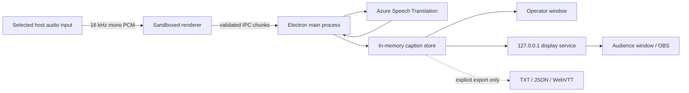

# Architecture

## Trust boundaries

The renderer cannot access Node.js. Context isolation and Electron sandboxing are enabled. The preload exposes a narrow typed API. Credentials, exports, and the provider live in the main process.

## Audio

`getUserMedia` targets the exact operator-selected audio-device ID with echo cancellation, noise suppression, and automatic gain disabled. An AudioWorklet performs linear resampling to 16 kHz and emits 100 ms mono signed-16-bit PCM chunks. Audio is not buffered to disk.

Device change events verify that the chosen device still exists. Loss pauses the session and requires explicit reselection.

## Provider contract

Providers emit normalized `CaptionSegment` and status events through the `SpeechProvider` interface in `src/shared/contracts.ts`. The Azure adapter is the only shipping provider. A fixture provider is compiled for deterministic tests but can be selected only in an unpackaged development build with `WLC_E2E=1`.

Final segments are retained in application memory for optional export. Only the current partial and two latest final segments are sent to displays. A final replaces a matching final ID and clears the active partial.

## Azure behavior

The provider uses Azure's universal v2 WebSocket endpoint and candidates `en-US` and `vi-VN`. Both target languages are requested. English is always mapped to the upper lane and Vietnamese to the lower lane, independently of source language.

Multilingual interim translations may be unavailable. An interim segment therefore guarantees only the source-language lane. The finalized event fills the translated lane. Language changes within a sentence remain unsupported.

## Recovery

Provider fatal events preserve all finalized segments, show `reconnecting`, and retry after 1, 2, 5, then 10 seconds. The audience unavailable notice is delayed five seconds. Reconnection never changes the selected audio device.

Warm offline fallback is not present in v0.1. The v0.2 design will wait ten seconds of cloud unavailability, start the independently benchmarked offline provider, and require operator confirmation before returning to cloud at a speech pause.

## Display service

The HTTP/WebSocket server binds explicitly to `127.0.0.1:43117`. It has no LAN mode. `/health` contains provider status and timestamps only—never captions, audio, or credentials. `/events` sends caption/status snapshots to local clients.
